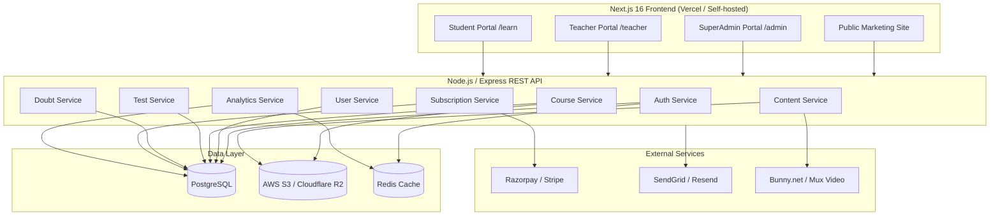
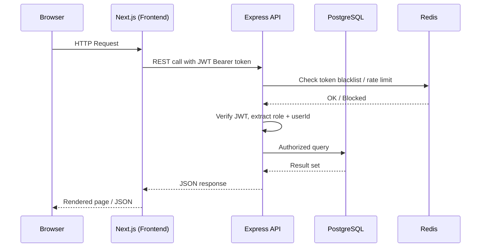
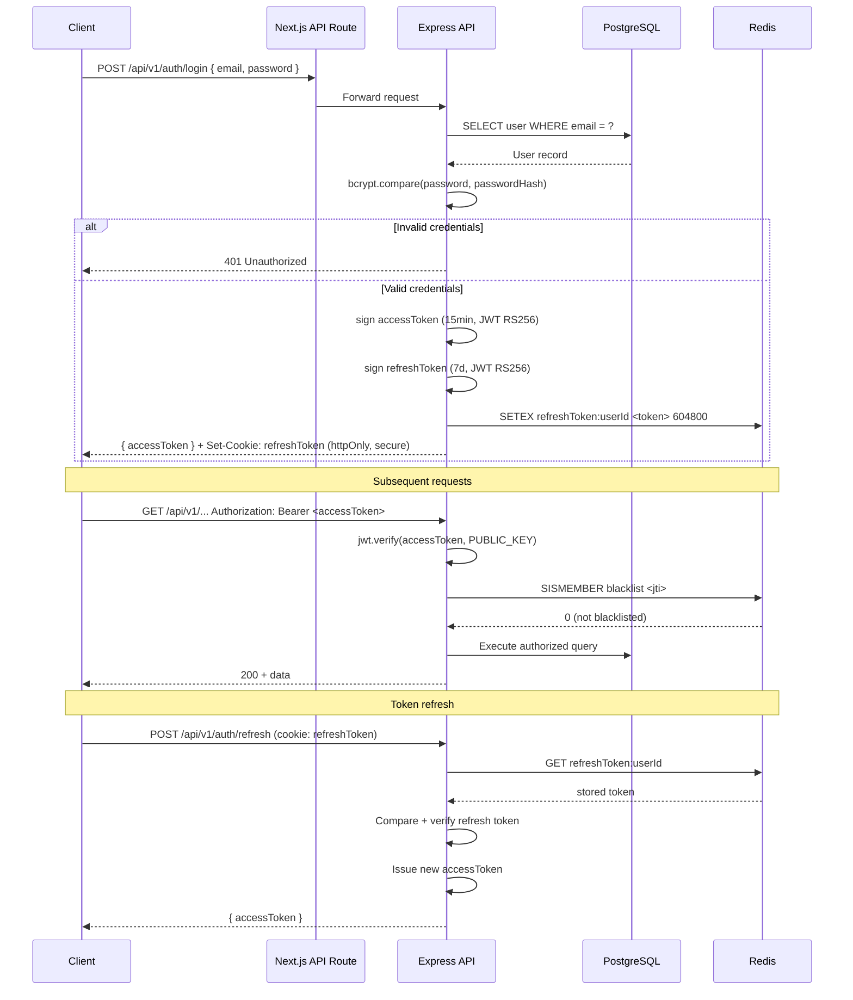
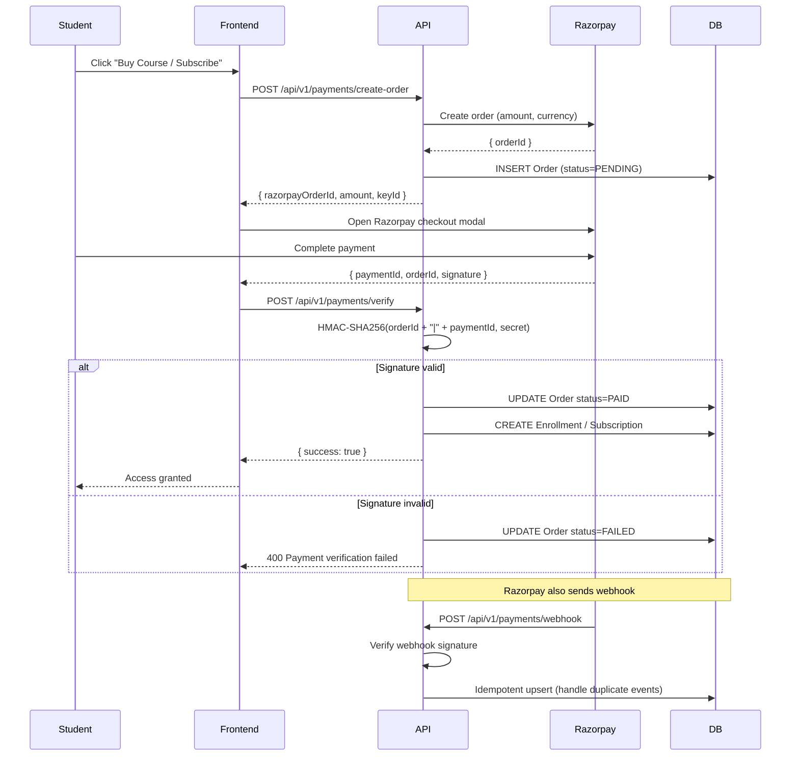

# Design Document: NobleMan Learning EdTech Platform


## Overview

NobleMan Learning is a full-stack EdTech platform built on a Next.js 16 frontend (already in place) with a dedicated Node.js/Express backend. The platform serves three distinct user roles — SuperAdmin, Teacher, and Student — each with their own portal, access controls, and feature set.

The system handles course management (videos, PDFs, notes), subscription billing, doubt/query routing between students and teachers, test/quiz delivery, and analytics. All three portals share a single REST API backend and a PostgreSQL database, with role-based access control (RBAC) enforced at every layer.

The existing Next.js project serves as the public-facing marketing site. The three portals will be added as route groups within the same Next.js app, keeping the monorepo simple while allowing independent layouts and auth guards per portal.

---

## Architecture

### High-Level System Components



### Request Data Flow



---

## Tech Stack Recommendations

| Layer | Technology | Rationale |
|---|---|---|
| Frontend | Next.js 16, React 19, TypeScript, Tailwind CSS 4 | Already in place |
| Backend | Node.js 20 LTS + Express 5 | Familiar JS ecosystem, easy to deploy |
| ORM | Prisma 5 | Type-safe queries, migrations, works great with PostgreSQL |
| Database | PostgreSQL 16 | Relational data with strong ACID guarantees |
| Cache / Sessions | Redis 7 (Upstash for serverless) | JWT blacklisting, rate limiting, leaderboard caching |
| File Storage | AWS S3 or Cloudflare R2 | PDFs, notes, thumbnails |
| Video Hosting | Bunny.net Stream or Mux | HLS streaming, DRM, signed URLs |
| Auth | JWT (access + refresh token pair) | Stateless, works across Next.js + API |
| Payments | Razorpay (India-first) | Subscriptions, one-time payments, webhooks |
| Email | Resend + React Email | Transactional emails |
| Deployment | Vercel (frontend) + Railway / Render (API) | Simple CI/CD |
| Monitoring | Sentry (errors) + PostHog (analytics) | Observability |

---

## Data Models

### User

```typescript
interface User {
  id: string                  // UUID
  email: string               // unique
  passwordHash: string
  role: "SUPERADMIN" | "TEACHER" | "STUDENT"
  firstName: string
  lastName: string
  phone?: string
  avatarUrl?: string
  isActive: boolean
  createdAt: Date
  updatedAt: Date

  // Relations
  teacherProfile?: TeacherProfile   // if role === TEACHER
  studentProfile?: StudentProfile   // if role === STUDENT
}

interface TeacherProfile {
  id: string
  userId: string              // FK → User
  bio?: string
  specialization?: string
  assignedStudents: StudentProfile[]
  courses: Course[]
}

interface StudentProfile {
  id: string
  userId: string              // FK → User
  assignedTeacherId?: string  // FK → TeacherProfile
  enrollments: Enrollment[]
  subscriptions: Subscription[]
}
```

### Course & Content

```typescript
interface Course {
  id: string
  title: string
  slug: string                // URL-friendly unique identifier
  description: string
  thumbnailUrl?: string
  teacherId: string           // FK → TeacherProfile
  price: number               // in paise (INR) or cents (USD)
  isFree: boolean
  isPublished: boolean
  createdAt: Date
  updatedAt: Date

  // Relations
  sections: CourseSection[]
  enrollments: Enrollment[]
  tests: Test[]
}

interface CourseSection {
  id: string
  courseId: string            // FK → Course
  title: string
  order: number               // display order
  contentItems: ContentItem[]
}

interface ContentItem {
  id: string
  sectionId: string           // FK → CourseSection
  title: string
  type: "VIDEO" | "PDF" | "NOTE" | "QUIZ_LINK"
  url?: string                // S3 / Bunny.net URL
  videoId?: string            // Bunny.net / Mux video ID
  durationSeconds?: number    // for videos
  order: number
  isFree: boolean             // preview content
  createdAt: Date
}
```

### Enrollment & Subscription

```typescript
interface Enrollment {
  id: string
  studentId: string           // FK → StudentProfile
  courseId: string            // FK → Course
  enrolledAt: Date
  completionPercent: number   // 0–100
  lastAccessedAt?: Date

  // Relations
  progress: ContentProgress[]
}

interface ContentProgress {
  id: string
  enrollmentId: string        // FK → Enrollment
  contentItemId: string       // FK → ContentItem
  completedAt?: Date
  watchedSeconds?: number     // for videos
}

interface Subscription {
  id: string
  studentId: string           // FK → StudentProfile
  planId: string              // FK → SubscriptionPlan
  status: "TRIAL" | "ACTIVE" | "EXPIRED" | "CANCELLED"
  startDate: Date
  endDate: Date
  razorpaySubscriptionId?: string
  createdAt: Date
}

interface SubscriptionPlan {
  id: string
  name: string                // e.g. "Monthly", "Annual"
  durationDays: number
  price: number               // in paise
  features: string[]          // JSON array
  isActive: boolean
}
```

### Doubt / Query

```typescript
interface Doubt {
  id: string
  studentId: string           // FK → StudentProfile (sender)
  teacherId: string           // FK → TeacherProfile (recipient)
  courseId?: string           // FK → Course (optional context)
  contentItemId?: string      // FK → ContentItem (optional context)
  subject: string
  body: string
  status: "OPEN" | "ANSWERED" | "CLOSED"
  createdAt: Date
  updatedAt: Date

  // Relations
  replies: DoubtReply[]
}

interface DoubtReply {
  id: string
  doubtId: string             // FK → Doubt
  authorId: string            // FK → User (teacher or student)
  body: string
  attachmentUrl?: string
  createdAt: Date
}
```

### Test / Quiz

```typescript
interface Test {
  id: string
  courseId: string            // FK → Course
  title: string
  description?: string
  durationMinutes: number
  passingScore: number        // percentage
  maxAttempts: number
  isPublished: boolean
  createdAt: Date

  // Relations
  questions: Question[]
  attempts: TestAttempt[]
}

interface Question {
  id: string
  testId: string              // FK → Test
  text: string
  type: "MCQ" | "TRUE_FALSE" | "SHORT_ANSWER"
  options?: string[]          // JSON array for MCQ
  correctAnswer: string
  marks: number
  order: number
}

interface TestAttempt {
  id: string
  testId: string              // FK → Test
  studentId: string           // FK → StudentProfile
  answers: Record<string, string>  // questionId → answer
  score: number
  passed: boolean
  startedAt: Date
  submittedAt?: Date
}
```

### Payment / Order

```typescript
interface Order {
  id: string
  studentId: string           // FK → StudentProfile
  courseId?: string           // FK → Course (one-time purchase)
  subscriptionPlanId?: string // FK → SubscriptionPlan
  amount: number              // in paise
  currency: string            // "INR"
  status: "PENDING" | "PAID" | "FAILED" | "REFUNDED"
  razorpayOrderId: string
  razorpayPaymentId?: string
  createdAt: Date
}
```

---

## API Design

All endpoints are prefixed with `/api/v1`. Authentication uses `Authorization: Bearer <accessToken>` header. Role guards are noted per endpoint.

### Auth Endpoints

```
POST   /api/v1/auth/register          — Public (student self-registration)
POST   /api/v1/auth/login             — Public
POST   /api/v1/auth/logout            — Authenticated (blacklists refresh token)
POST   /api/v1/auth/refresh           — Public (uses refresh token cookie)
POST   /api/v1/auth/forgot-password   — Public
POST   /api/v1/auth/reset-password    — Public (token from email)
GET    /api/v1/auth/me                — Authenticated (returns current user)
```

### SuperAdmin — User Management

```
GET    /api/v1/admin/users                    — SUPERADMIN
POST   /api/v1/admin/users                    — SUPERADMIN (create teacher or student)
GET    /api/v1/admin/users/:id                — SUPERADMIN
PATCH  /api/v1/admin/users/:id                — SUPERADMIN
DELETE /api/v1/admin/users/:id                — SUPERADMIN (soft delete)
GET    /api/v1/admin/teachers                 — SUPERADMIN
GET    /api/v1/admin/students                 — SUPERADMIN
PATCH  /api/v1/admin/students/:id/assign-teacher  — SUPERADMIN
```

### SuperAdmin — Subscriptions

```
GET    /api/v1/admin/subscriptions            — SUPERADMIN (all, filterable by status)
GET    /api/v1/admin/subscriptions/:studentId — SUPERADMIN
GET    /api/v1/admin/plans                    — SUPERADMIN
POST   /api/v1/admin/plans                    — SUPERADMIN
PATCH  /api/v1/admin/plans/:id                — SUPERADMIN
DELETE /api/v1/admin/plans/:id                — SUPERADMIN
```

### SuperAdmin — Doubts Overview

```
GET    /api/v1/admin/doubts                   — SUPERADMIN (all doubts, filterable)
GET    /api/v1/admin/doubts/:id               — SUPERADMIN
```

### SuperAdmin — Analytics

```
GET    /api/v1/admin/analytics/overview       — SUPERADMIN
  Response: { totalRevenue, totalStudents, totalTeachers, activeSubscriptions,
              newEnrollmentsThisMonth, activeUsersToday }

GET    /api/v1/admin/analytics/revenue        — SUPERADMIN
  Query: ?from=YYYY-MM-DD&to=YYYY-MM-DD&groupBy=day|week|month

GET    /api/v1/admin/analytics/enrollments    — SUPERADMIN
  Query: ?courseId=&from=&to=

GET    /api/v1/admin/analytics/active-users   — SUPERADMIN
  Query: ?period=7d|30d|90d
```

### Course Management (SuperAdmin + Teacher)

```
GET    /api/v1/courses                        — Authenticated (students see published only)
POST   /api/v1/courses                        — SUPERADMIN | TEACHER
GET    /api/v1/courses/:id                    — Authenticated
PATCH  /api/v1/courses/:id                    — SUPERADMIN | TEACHER (own courses)
DELETE /api/v1/courses/:id                    — SUPERADMIN | TEACHER (own courses)
PATCH  /api/v1/courses/:id/publish            — SUPERADMIN | TEACHER

GET    /api/v1/courses/:id/sections           — Authenticated
POST   /api/v1/courses/:id/sections           — SUPERADMIN | TEACHER
PATCH  /api/v1/courses/:id/sections/:sectionId        — SUPERADMIN | TEACHER
DELETE /api/v1/courses/:id/sections/:sectionId        — SUPERADMIN | TEACHER

POST   /api/v1/courses/:id/sections/:sectionId/content        — SUPERADMIN | TEACHER
PATCH  /api/v1/courses/:id/sections/:sectionId/content/:itemId — SUPERADMIN | TEACHER
DELETE /api/v1/courses/:id/sections/:sectionId/content/:itemId — SUPERADMIN | TEACHER
POST   /api/v1/courses/:id/sections/:sectionId/content/:itemId/upload
  — SUPERADMIN | TEACHER (returns presigned S3 URL)
```

### Tests / Quizzes

```
GET    /api/v1/courses/:courseId/tests        — Authenticated
POST   /api/v1/courses/:courseId/tests        — SUPERADMIN | TEACHER
GET    /api/v1/courses/:courseId/tests/:testId — Authenticated
PATCH  /api/v1/courses/:courseId/tests/:testId — SUPERADMIN | TEACHER
DELETE /api/v1/courses/:courseId/tests/:testId — SUPERADMIN | TEACHER

POST   /api/v1/tests/:testId/questions        — SUPERADMIN | TEACHER
PATCH  /api/v1/tests/:testId/questions/:qId   — SUPERADMIN | TEACHER
DELETE /api/v1/tests/:testId/questions/:qId   — SUPERADMIN | TEACHER

POST   /api/v1/tests/:testId/attempt          — STUDENT (start attempt)
POST   /api/v1/tests/:testId/attempt/:attemptId/submit — STUDENT
GET    /api/v1/tests/:testId/attempts         — STUDENT (own) | TEACHER | SUPERADMIN
GET    /api/v1/tests/:testId/attempts/:attemptId — Authenticated
```

### Enrollments

```
GET    /api/v1/enrollments                    — STUDENT (own) | SUPERADMIN
POST   /api/v1/enrollments                    — STUDENT (after payment)
GET    /api/v1/enrollments/:id                — Authenticated
POST   /api/v1/enrollments/:id/progress       — STUDENT (mark content complete)
```

### Doubts / Queries

```
GET    /api/v1/doubts                         — STUDENT (own) | TEACHER (assigned) | SUPERADMIN
POST   /api/v1/doubts                         — STUDENT
GET    /api/v1/doubts/:id                     — Authenticated (student owner | assigned teacher | admin)
PATCH  /api/v1/doubts/:id/status              — TEACHER | SUPERADMIN
POST   /api/v1/doubts/:id/replies             — STUDENT (own doubt) | TEACHER (assigned)
GET    /api/v1/doubts/:id/replies             — Authenticated
```

### Teacher Portal

```
GET    /api/v1/teacher/dashboard              — TEACHER
  Response: { assignedStudents, openDoubts, myCourses, recentActivity }

GET    /api/v1/teacher/students               — TEACHER (own assigned students only)
GET    /api/v1/teacher/students/:studentId    — TEACHER (own assigned only)
GET    /api/v1/teacher/doubts                 — TEACHER (doubts sent to them)
```

### Student Portal

```
GET    /api/v1/student/dashboard              — STUDENT
  Response: { enrolledCourses, subscription, openDoubts, recentTests }

GET    /api/v1/student/courses                — STUDENT (enrolled courses)
GET    /api/v1/student/courses/:courseId/content — STUDENT (enrolled only)
GET    /api/v1/student/subscription           — STUDENT
```

### Payments

```
POST   /api/v1/payments/create-order          — STUDENT
  Body: { courseId? | subscriptionPlanId?, amount }
  Response: { razorpayOrderId, amount, currency, keyId }

POST   /api/v1/payments/verify                — STUDENT
  Body: { razorpayOrderId, razorpayPaymentId, razorpaySignature }

POST   /api/v1/payments/webhook               — Public (Razorpay webhook, HMAC verified)
```

### File Upload

```
POST   /api/v1/upload/presigned-url           — SUPERADMIN | TEACHER
  Body: { fileName, fileType, folder }
  Response: { uploadUrl, fileUrl }
```

---

## Frontend Structure (Next.js Route Groups)

The existing Next.js app uses the App Router. Each portal lives in its own route group with its own layout and auth guard middleware.

```
src/
├── app/
│   ├── (marketing)/                  ← existing public site
│   │   ├── layout.tsx
│   │   └── page.tsx
│   │
│   ├── (auth)/                       ← shared auth pages
│   │   ├── login/
│   │   │   └── page.tsx
│   │   ├── register/
│   │   │   └── page.tsx
│   │   ├── forgot-password/
│   │   │   └── page.tsx
│   │   └── reset-password/
│   │       └── page.tsx
│   │
│   ├── (admin)/                      ← SuperAdmin portal
│   │   ├── layout.tsx                ← AdminLayout with sidebar, role guard
│   │   └── admin/
│   │       ├── page.tsx              ← Dashboard / analytics overview
│   │       ├── users/
│   │       │   ├── page.tsx          ← All users list
│   │       │   ├── teachers/
│   │       │   │   └── page.tsx
│   │       │   ├── students/
│   │       │   │   └── page.tsx
│   │       │   └── [id]/
│   │       │       └── page.tsx      ← User detail
│   │       ├── courses/
│   │       │   ├── page.tsx          ← All courses
│   │       │   ├── new/
│   │       │   │   └── page.tsx
│   │       │   └── [id]/
│   │       │       ├── page.tsx      ← Course editor
│   │       │       └── tests/
│   │       │           └── page.tsx
│   │       ├── subscriptions/
│   │       │   └── page.tsx
│   │       ├── doubts/
│   │       │   └── page.tsx
│   │       └── analytics/
│   │           └── page.tsx
│   │
│   ├── (teacher)/                    ← Teacher portal
│   │   ├── layout.tsx                ← TeacherLayout with sidebar, role guard
│   │   └── teacher/
│   │       ├── page.tsx              ← Teacher dashboard
│   │       ├── students/
│   │       │   ├── page.tsx          ← Assigned students list
│   │       │   └── [id]/
│   │       │       └── page.tsx      ← Student detail
│   │       ├── courses/
│   │       │   ├── page.tsx          ← Teacher's courses
│   │       │   ├── new/
│   │       │   │   └── page.tsx
│   │       │   └── [id]/
│   │       │       └── page.tsx      ← Course editor
│   │       └── doubts/
│   │           ├── page.tsx          ← All doubts sent to teacher
│   │           └── [id]/
│   │               └── page.tsx      ← Doubt thread
│   │
│   └── (student)/                    ← Student portal
│       ├── layout.tsx                ← StudentLayout with nav, role guard
│       └── learn/
│           ├── page.tsx              ← Student dashboard
│           ├── courses/
│           │   ├── page.tsx          ← My courses
│           │   └── [courseId]/
│           │       ├── page.tsx      ← Course overview
│           │       └── [contentId]/
│           │           └── page.tsx  ← Content viewer (video/PDF/note)
│           ├── tests/
│           │   ├── page.tsx          ← My test results
│           │   └── [testId]/
│           │       └── page.tsx      ← Take test
│           ├── doubts/
│           │   ├── page.tsx          ← My doubts
│           │   ├── new/
│           │   │   └── page.tsx
│           │   └── [id]/
│           │       └── page.tsx      ← Doubt thread
│           └── subscription/
│               └── page.tsx          ← Subscription status + upgrade
│
├── components/
│   ├── (existing marketing components...)
│   ├── admin/                        ← Admin-specific components
│   ├── teacher/                      ← Teacher-specific components
│   ├── student/                      ← Student-specific components
│   └── shared/                       ← Shared UI (tables, modals, forms)
│
├── lib/
│   ├── api.ts                        ← Axios/fetch client with interceptors
│   ├── auth.ts                       ← Token management, auth helpers
│   └── utils.ts
│
├── hooks/
│   ├── useAuth.ts
│   ├── useCourses.ts
│   └── useDoubts.ts
│
├── types/
│   └── index.ts                      ← Shared TypeScript types
│
└── middleware.ts                     ← Next.js middleware for route protection
```

### Middleware Route Protection

```typescript
// src/middleware.ts
import { NextRequest, NextResponse } from "next/server"
import { verifyToken } from "@/lib/auth"

const ROLE_ROUTES: Record<string, string[]> = {
  "/admin": ["SUPERADMIN"],
  "/teacher": ["TEACHER", "SUPERADMIN"],
  "/learn": ["STUDENT"],
}

export function middleware(request: NextRequest) {
  const { pathname } = request.nextUrl
  const token = request.cookies.get("accessToken")?.value

  for (const [prefix, allowedRoles] of Object.entries(ROLE_ROUTES)) {
    if (pathname.startsWith(prefix)) {
      if (!token) {
        return NextResponse.redirect(new URL("/login", request.url))
      }
      const payload = verifyToken(token)
      if (!payload || !allowedRoles.includes(payload.role)) {
        return NextResponse.redirect(new URL("/unauthorized", request.url))
      }
    }
  }
  return NextResponse.next()
}

export const config = {
  matcher: ["/admin/:path*", "/teacher/:path*", "/learn/:path*"],
}
```

---

## Low-Level Design

### Authentication Flow



### Role-Based Access Control (RBAC)

```typescript
// Backend middleware — src/middleware/rbac.ts

type Role = "SUPERADMIN" | "TEACHER" | "STUDENT"

interface JWTPayload {
  sub: string       // userId
  role: Role
  jti: string       // JWT ID for blacklisting
  iat: number
  exp: number
}

// Permission matrix
const PERMISSIONS = {
  "courses:create":         ["SUPERADMIN", "TEACHER"],
  "courses:edit:own":       ["TEACHER"],
  "courses:edit:any":       ["SUPERADMIN"],
  "courses:delete:own":     ["TEACHER"],
  "courses:delete:any":     ["SUPERADMIN"],
  "users:manage":           ["SUPERADMIN"],
  "doubts:view:own":        ["STUDENT"],
  "doubts:view:assigned":   ["TEACHER"],
  "doubts:view:all":        ["SUPERADMIN"],
  "analytics:view":         ["SUPERADMIN"],
  "subscriptions:manage":   ["SUPERADMIN"],
  "tests:attempt":          ["STUDENT"],
  "tests:create":           ["SUPERADMIN", "TEACHER"],
} as const

function requirePermission(permission: keyof typeof PERMISSIONS) {
  return (req: Request, res: Response, next: NextFunction) => {
    const user = req.user as JWTPayload
    const allowed = PERMISSIONS[permission] as readonly string[]
    if (!allowed.includes(user.role)) {
      return res.status(403).json({ error: "Forbidden" })
    }
    next()
  }
}

// Resource ownership check (teacher can only edit own courses)
function requireOwnership(resourceField: string) {
  return async (req: Request, res: Response, next: NextFunction) => {
    const user = req.user as JWTPayload
    if (user.role === "SUPERADMIN") return next()
    const resource = await getResource(req.params.id)
    if (resource[resourceField] !== user.sub) {
      return res.status(403).json({ error: "Not your resource" })
    }
    next()
  }
}
```

### Doubt Routing Algorithm

```pascal
ALGORITHM routeDoubt(studentId, doubtData)
INPUT: studentId (UUID), doubtData { subject, body, courseId? }
OUTPUT: Doubt record

BEGIN
  student ← db.StudentProfile.findById(studentId)

  IF student.assignedTeacherId IS NULL THEN
    // Fallback: assign to course teacher if course is specified
    IF doubtData.courseId IS NOT NULL THEN
      course ← db.Course.findById(doubtData.courseId)
      teacherId ← course.teacherId
    ELSE
      THROW Error("No teacher assigned and no course context")
    END IF
  ELSE
    teacherId ← student.assignedTeacherId
  END IF

  doubt ← db.Doubt.create({
    studentId: studentId,
    teacherId: teacherId,
    courseId: doubtData.courseId,
    subject: doubtData.subject,
    body: doubtData.body,
    status: "OPEN"
  })

  // Notify teacher via email
  ASYNC sendEmail({
    to: teacher.user.email,
    template: "new-doubt",
    data: { teacherName, studentName, subject, doubtUrl }
  })

  RETURN doubt
END
```

### Test Scoring Algorithm

```pascal
ALGORITHM scoreTestAttempt(attemptId, answers)
INPUT: attemptId (UUID), answers (Map<questionId, answer>)
OUTPUT: TestAttempt with score

BEGIN
  attempt ← db.TestAttempt.findById(attemptId)
  test ← db.Test.findById(attempt.testId)

  ASSERT attempt.submittedAt IS NULL  // not already submitted
  ASSERT now() <= attempt.startedAt + test.durationMinutes * 60

  totalMarks ← 0
  earnedMarks ← 0

  FOR each question IN test.questions DO
    totalMarks ← totalMarks + question.marks
    studentAnswer ← answers[question.id]

    IF question.type = "MCQ" OR question.type = "TRUE_FALSE" THEN
      IF normalize(studentAnswer) = normalize(question.correctAnswer) THEN
        earnedMarks ← earnedMarks + question.marks
      END IF
    ELSE IF question.type = "SHORT_ANSWER" THEN
      // Short answers are marked manually; default 0 until reviewed
      earnedMarks ← earnedMarks + 0
    END IF
  END FOR

  scorePercent ← (earnedMarks / totalMarks) * 100
  passed ← scorePercent >= test.passingScore

  db.TestAttempt.update(attemptId, {
    answers: answers,
    score: scorePercent,
    passed: passed,
    submittedAt: now()
  })

  RETURN updated attempt
END
```

### Subscription Access Control

```pascal
ALGORITHM checkContentAccess(studentId, contentItemId)
INPUT: studentId (UUID), contentItemId (UUID)
OUTPUT: boolean (hasAccess)

BEGIN
  contentItem ← db.ContentItem.findById(contentItemId)

  // Free preview content is always accessible
  IF contentItem.isFree = true THEN
    RETURN true
  END IF

  course ← contentItem.section.course

  // Check enrollment
  enrollment ← db.Enrollment.findOne({
    studentId: studentId,
    courseId: course.id
  })

  IF enrollment IS NULL THEN
    RETURN false
  END IF

  // If course is free, enrollment is sufficient
  IF course.isFree = true THEN
    RETURN true
  END IF

  // Check active subscription
  subscription ← db.Subscription.findOne({
    studentId: studentId,
    status: IN ["TRIAL", "ACTIVE"],
    endDate: >= now()
  })

  IF subscription IS NOT NULL THEN
    RETURN true
  END IF

  // Check one-time course purchase
  order ← db.Order.findOne({
    studentId: studentId,
    courseId: course.id,
    status: "PAID"
  })

  RETURN order IS NOT NULL
END
```

### Payment Verification Flow



### Analytics Aggregation

```pascal
ALGORITHM getRevenueAnalytics(from, to, groupBy)
INPUT: from (Date), to (Date), groupBy ("day" | "week" | "month")
OUTPUT: Array of { period, revenue, orderCount }

BEGIN
  ASSERT from <= to
  ASSERT groupBy IN ["day", "week", "month"]

  // Use PostgreSQL date_trunc for grouping
  query ← """
    SELECT
      date_trunc(:groupBy, created_at) AS period,
      SUM(amount) AS revenue,
      COUNT(*) AS order_count
    FROM orders
    WHERE status = 'PAID'
      AND created_at BETWEEN :from AND :to
    GROUP BY period
    ORDER BY period ASC
  """

  results ← db.raw(query, { groupBy, from, to })

  // Cache result for 5 minutes
  Redis.SETEX(cacheKey, 300, JSON.stringify(results))

  RETURN results
END
```

---

## Components and Interfaces

### Backend Service Interfaces

```typescript
// Auth Service
interface IAuthService {
  login(email: string, password: string): Promise<{ accessToken: string }>
  logout(userId: string, jti: string): Promise<void>
  refreshToken(refreshToken: string): Promise<{ accessToken: string }>
  forgotPassword(email: string): Promise<void>
  resetPassword(token: string, newPassword: string): Promise<void>
}

// User Service
interface IUserService {
  createUser(data: CreateUserDTO): Promise<User>
  getUserById(id: string): Promise<User>
  updateUser(id: string, data: UpdateUserDTO): Promise<User>
  softDeleteUser(id: string): Promise<void>
  listUsers(filters: UserFilters): Promise<PaginatedResult<User>>
  assignTeacherToStudent(studentId: string, teacherId: string): Promise<void>
}

// Course Service
interface ICourseService {
  createCourse(data: CreateCourseDTO, teacherId: string): Promise<Course>
  updateCourse(id: string, data: UpdateCourseDTO): Promise<Course>
  publishCourse(id: string): Promise<Course>
  addSection(courseId: string, data: CreateSectionDTO): Promise<CourseSection>
  addContentItem(sectionId: string, data: CreateContentDTO): Promise<ContentItem>
  getPresignedUploadUrl(fileName: string, fileType: string): Promise<string>
}

// Doubt Service
interface IDoubtService {
  createDoubt(studentId: string, data: CreateDoubtDTO): Promise<Doubt>
  replyToDoubt(doubtId: string, authorId: string, body: string): Promise<DoubtReply>
  updateStatus(doubtId: string, status: DoubtStatus): Promise<Doubt>
  listDoubts(filters: DoubtFilters, requesterId: string, role: Role): Promise<PaginatedResult<Doubt>>
}

// Subscription Service
interface ISubscriptionService {
  createOrder(studentId: string, data: CreateOrderDTO): Promise<Order>
  verifyPayment(data: VerifyPaymentDTO): Promise<{ success: boolean }>
  handleWebhook(payload: unknown, signature: string): Promise<void>
  getStudentSubscription(studentId: string): Promise<Subscription | null>
}

// Analytics Service
interface IAnalyticsService {
  getOverview(): Promise<AnalyticsOverview>
  getRevenue(from: Date, to: Date, groupBy: string): Promise<RevenueData[]>
  getEnrollments(filters: EnrollmentFilters): Promise<EnrollmentData[]>
  getActiveUsers(period: string): Promise<ActiveUserData>
}
```

### Frontend Component Interfaces

```typescript
// Shared table component
interface DataTableProps<T> {
  data: T[]
  columns: ColumnDef<T>[]
  isLoading?: boolean
  pagination?: PaginationState
  onPaginationChange?: (state: PaginationState) => void
  onRowClick?: (row: T) => void
}

// Course content viewer
interface ContentViewerProps {
  contentItem: ContentItem
  onComplete: (itemId: string) => void
  onNext?: () => void
  onPrev?: () => void
}

// Doubt thread
interface DoubtThreadProps {
  doubt: Doubt
  replies: DoubtReply[]
  currentUserId: string
  onReply: (body: string, attachment?: File) => Promise<void>
  onStatusChange?: (status: DoubtStatus) => Promise<void>
}

// Analytics chart
interface RevenueChartProps {
  data: RevenueData[]
  groupBy: "day" | "week" | "month"
  onGroupByChange: (groupBy: string) => void
}
```

---

## Error Handling

### Error Response Format

All API errors follow a consistent shape:

```typescript
interface APIError {
  error: string         // machine-readable code, e.g. "INVALID_CREDENTIALS"
  message: string       // human-readable description
  details?: unknown     // validation errors, field-level info
  requestId: string     // for tracing
}
```

### Error Scenarios

**Authentication Errors**
- Condition: Invalid credentials on login
- Response: `401 { error: "INVALID_CREDENTIALS", message: "Email or password is incorrect" }`
- Recovery: User retries; after 5 failures, account is locked for 15 minutes (tracked in Redis)

**Authorization Errors**
- Condition: User accesses a resource outside their role
- Response: `403 { error: "FORBIDDEN", message: "You do not have permission" }`
- Recovery: Redirect to appropriate portal dashboard

**Resource Not Found**
- Condition: Entity with given ID does not exist or is soft-deleted
- Response: `404 { error: "NOT_FOUND", message: "Resource not found" }`

**Validation Errors**
- Condition: Request body fails Zod schema validation
- Response: `422 { error: "VALIDATION_ERROR", details: [{ field, message }] }`

**Payment Verification Failure**
- Condition: Razorpay signature mismatch
- Response: `400 { error: "PAYMENT_VERIFICATION_FAILED" }`
- Recovery: Order stays PENDING; user can retry; webhook provides fallback

**Content Access Denied**
- Condition: Student tries to access content without enrollment or active subscription
- Response: `403 { error: "CONTENT_ACCESS_DENIED", message: "Purchase or subscribe to access" }`
- Recovery: Frontend redirects to subscription/purchase page

**File Upload Errors**
- Condition: File type not allowed or size exceeds limit (500MB for video, 50MB for PDF)
- Response: `413 { error: "FILE_TOO_LARGE" }` or `415 { error: "UNSUPPORTED_MEDIA_TYPE" }`

**Rate Limiting**
- Condition: More than 100 requests/minute per IP on auth endpoints
- Response: `429 { error: "RATE_LIMITED", message: "Too many requests" }`
- Recovery: Retry after `Retry-After` header value

---

## Testing Strategy

### Unit Testing

- **Framework**: Vitest (already compatible with the Vite/Next.js ecosystem)
- **Backend**: Jest + Supertest for Express route handlers
- **Coverage targets**: 80% for service layer, 70% for route handlers

Key unit test areas:
- Auth service: login, token generation, refresh, blacklisting
- RBAC middleware: all role/permission combinations
- Scoring algorithm: MCQ, true/false, edge cases (empty answers, time expired)
- Subscription access control: all combinations of enrollment/subscription/free content
- Payment signature verification: valid and tampered signatures

### Property-Based Testing

- **Library**: fast-check (TypeScript-native)

Properties to verify:
- Scoring: `∀ attempt. 0 ≤ attempt.score ≤ 100`
- Scoring: `∀ attempt where all answers correct. attempt.score = 100`
- Access control: `∀ content marked isFree. checkContentAccess(anyStudent, content) = true`
- Pagination: `∀ page, pageSize. results.length ≤ pageSize`
- Revenue aggregation: `sum(daily) = sum(weekly) = sum(monthly)` over same period

### Integration Testing

- Test full auth flow: register → login → access protected route → refresh → logout
- Test enrollment flow: create order → verify payment → check enrollment created → access content
- Test doubt flow: student submits → teacher receives → teacher replies → student sees reply
- Test RBAC: each role attempting each endpoint category

### E2E Testing

- **Framework**: Playwright
- Critical paths: student signup → purchase course → watch video → take test → submit doubt
- Admin path: create course → add content → publish → verify student can enroll

---

## Security Considerations

### Authentication & Session Security
- Passwords hashed with bcrypt (cost factor 12)
- Access tokens: short-lived (15 min), RS256 signed (asymmetric keys)
- Refresh tokens: httpOnly, Secure, SameSite=Strict cookies; stored hash in Redis
- JWT blacklist in Redis on logout (by `jti` claim)
- Brute-force protection: 5 failed logins → 15-minute lockout per account (Redis counter)

### API Security
- All endpoints behind HTTPS (TLS 1.2+)
- CORS restricted to known frontend origins
- Helmet.js for security headers (CSP, HSTS, X-Frame-Options)
- Rate limiting: 100 req/min on auth, 1000 req/min on general endpoints (Redis sliding window)
- Input validation with Zod on every request body
- SQL injection prevention via Prisma parameterized queries (no raw string interpolation)

### Content Security
- S3/R2 objects are private; access via presigned URLs (15-minute expiry)
- Video content served via signed Bunny.net/Mux URLs; direct URL sharing is useless after expiry
- File type validation server-side (MIME type + magic bytes, not just extension)
- Max file size enforced at API layer before S3 upload

### Payment Security
- Razorpay webhook signature verified with HMAC-SHA256 before processing
- Payment amounts validated server-side against database prices (never trust client-sent amount)
- Idempotency keys on order creation to prevent duplicate charges

### Data Privacy
- Passwords never logged or returned in API responses
- PII fields (email, phone) excluded from analytics aggregations
- Soft deletes preserve data integrity; hard delete available only to SuperAdmin with confirmation

---

## Performance Considerations

### Caching Strategy
- Redis cache for analytics queries (5-minute TTL) — avoids expensive aggregations on every dashboard load
- Redis cache for course catalog (1-minute TTL) — high read, low write
- Next.js `unstable_cache` / `revalidateTag` for ISR on public course pages
- CDN (Cloudflare) in front of the Next.js frontend for static assets

### Database Optimization
- Indexes on: `users.email`, `enrollments.(studentId, courseId)`, `doubts.(teacherId, status)`, `orders.(studentId, status)`, `subscriptions.(studentId, status, endDate)`
- Pagination on all list endpoints (cursor-based for large datasets like analytics)
- `SELECT` only needed columns; avoid `SELECT *` in service layer
- Connection pooling via Prisma's built-in pool (max 10 connections per instance)

### Video Delivery
- Videos stored on Bunny.net Stream or Mux — both provide global CDN, adaptive bitrate HLS, and DRM
- Thumbnails and PDFs on Cloudflare R2 (zero egress cost)
- Lazy-load content items in course sections (only load visible section)

### Frontend Performance
- Route-level code splitting (automatic with Next.js App Router)
- Suspense boundaries around data-fetching components
- Optimistic UI updates for doubt replies and progress tracking
- `react-query` / SWR for client-side data fetching with stale-while-revalidate

---

## Dependencies

### Backend (New — Express API)

```json
{
  "dependencies": {
    "express": "^5.0.0",
    "prisma": "^5.22.0",
    "@prisma/client": "^5.22.0",
    "jsonwebtoken": "^9.0.2",
    "bcryptjs": "^2.4.3",
    "zod": "^3.23.8",
    "ioredis": "^5.4.1",
    "aws-sdk": "^2.1691.0",
    "razorpay": "^2.9.5",
    "resend": "^4.0.0",
    "helmet": "^8.0.0",
    "cors": "^2.8.5",
    "express-rate-limit": "^7.4.1",
    "rate-limit-redis": "^4.2.0",
    "morgan": "^1.10.0",
    "winston": "^3.15.0",
    "uuid": "^10.0.0"
  },
  "devDependencies": {
    "typescript": "^5.6.3",
    "tsx": "^4.19.1",
    "jest": "^29.7.0",
    "supertest": "^7.0.0",
    "fast-check": "^3.22.0",
    "@types/express": "^5.0.0",
    "@types/jsonwebtoken": "^9.0.7",
    "@types/bcryptjs": "^2.4.6"
  }
}
```

### Frontend Additions (to existing Next.js project)

```json
{
  "dependencies": {
    "@tanstack/react-query": "^5.59.0",
    "axios": "^1.7.7",
    "zod": "^3.23.8",
    "react-hook-form": "^7.53.0",
    "@hookform/resolvers": "^3.9.0",
    "razorpay": "^2.9.5",
    "recharts": "^2.13.0",
    "@tanstack/react-table": "^8.20.5",
    "react-player": "^2.16.0",
    "react-pdf": "^9.1.1",
    "sonner": "^1.5.0",
    "date-fns": "^4.1.0"
  }
}
```

### Infrastructure

| Service | Purpose | Free Tier |
|---|---|---|
| Vercel | Frontend hosting | Yes |
| Railway / Render | Express API hosting | Yes (limited) |
| Neon / Supabase | PostgreSQL | Yes |
| Upstash | Redis | Yes |
| Cloudflare R2 | File storage | 10GB free |
| Bunny.net Stream | Video hosting | Pay-as-you-go |
| Razorpay | Payments | No monthly fee |
| Resend | Email | 3000/month free |
| Sentry | Error monitoring | 5000 errors/month free |

---

## Correctness Properties

The following properties must hold throughout the system:

1. **Access invariant**: A student can only access non-free content if they have a PAID order for the course OR an ACTIVE/TRIAL subscription that has not expired.

2. **Doubt routing invariant**: Every doubt must have exactly one assigned teacher. If a student has no assigned teacher, the doubt is routed to the course's teacher. If neither exists, doubt creation fails with a clear error.

3. **Score bounds**: For any submitted test attempt, `0 ≤ score ≤ 100`.

4. **Payment idempotency**: Processing the same Razorpay webhook event twice must not create duplicate enrollments or subscriptions.

5. **Role exclusivity**: A user has exactly one role. A user with role TEACHER cannot access student-only endpoints, and vice versa.

6. **Soft delete visibility**: Soft-deleted users do not appear in any list endpoint and cannot log in, but their historical data (orders, enrollments, doubts) is preserved for audit purposes.

7. **Subscription date integrity**: `subscription.startDate < subscription.endDate` always holds. A subscription with `endDate < now()` is treated as EXPIRED regardless of its stored status field.

8. **Content order consistency**: Within a course section, `contentItem.order` values are unique and contiguous. Reordering one item triggers a reindex of all sibling items.

9. **Test attempt limit**: A student cannot start a new attempt for a test if they have already reached `test.maxAttempts` submitted attempts.

10. **Revenue aggregation consistency**: The sum of daily revenue over any period equals the sum of weekly revenue over the same period, which equals the sum of monthly revenue over the same period (modulo period boundary alignment).
